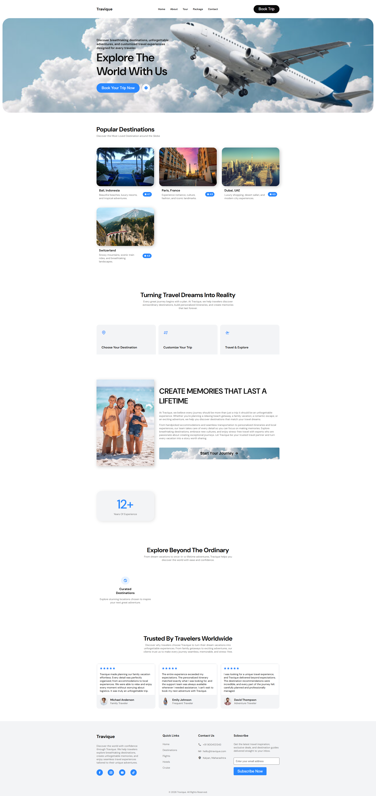

# ✈️ Travique - Travel & Tour Website

Travique is a modern and fully responsive travel website designed to provide users with an engaging travel experience. The project features attractive destination showcases, service sections, testimonials, and a clean user-friendly interface built using HTML, CSS, and JavaScript.

## 🚀 Live Demo

👉 https://travique-travel.netlify.app

## 📸 Preview



## 📌 Features

- Responsive Design
- Modern and Clean UI
- Interactive Navigation
- Destination Showcase
- Travel Packages Section
- Customer Testimonials
- Services Section
- Smooth Scrolling
- Mobile-Friendly Layout
- Cross-Browser Compatibility

## 🛠️ Technologies Used

- HTML5
- CSS3
- JavaScript (ES6+)
- Responsive Web Design

## 📂 Project Structure

```bash
index.html
style.css
script.js
assets/
images/
```

## 💻 Installation

```bash
git clone https://github.com/devanshkolhe14/travique-travel-website.git

cd travique-travel-website
```

Open `index.html` in your browser.

## 🎯 Purpose

This project was created to demonstrate frontend development skills, responsive web design principles, and modern UI/UX practices through a travel and tourism themed website.

## 🌟 Highlights

- Fully Responsive Design
- Attractive Travel Destination Layout
- Optimized User Experience
- Clean and Maintainable Code Structure
- Professional Landing Page Design

## 👨‍💻 Author

**Devansh Kolhe**

Frontend Developer from Mumbai, India

## 📬 Contact

📧 Email: devanshkolhe95@gmail.com

🌐 Portfolio: https://devanshkolheportfolio.netlify.app

🔗 GitHub: https://github.com/devanshkolhe14

## ⭐ Support

If you like this project, consider giving it a star on GitHub.
